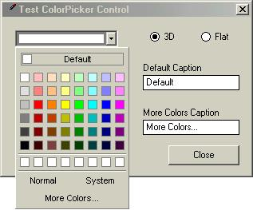



## ColorPicker\.ZIP

### Description

It will dropdown a color picker, which is very similar to those found in MSOffice 2000
 
### More Info
 

             |
---                |---
**Submitted On**   |2000-12-09 01:22:30
**By**             |[Abdul Gafoor\.GK](https://github.com/Planet-Source-Code/PSCIndex/blob/master/ByAuthor/abdul-gafoor-gk.md)
**Level**          |Intermediate
**User Rating**    |4.6 (78 globes from 17 users)
**Compatibility**  |VB 6\.0
**Category**       |[OLE/ COM/ DCOM/ Active\-X](https://github.com/Planet-Source-Code/PSCIndex/blob/master/ByCategory/ole-com-dcom-active-x__1-29.md)
**World**          |[Visual Basic](https://github.com/Planet-Source-Code/PSCIndex/blob/master/ByWorld/visual-basic.md)
**Archive File**   |[CODE\_UPLOAD124851282000\.zip](https://github.com/Planet-Source-Code/abdul-gafoor-gk-colorpicker-zip__1-13443/archive/master.zip)

